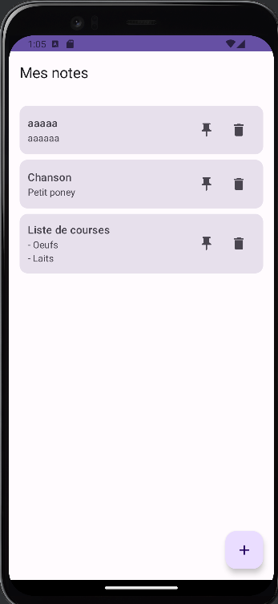
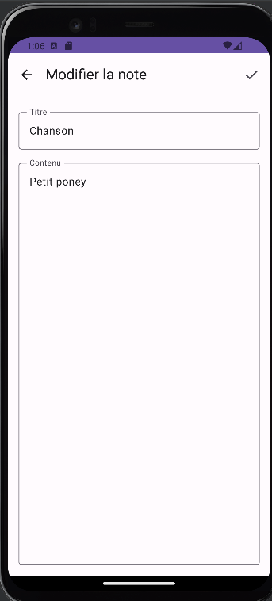
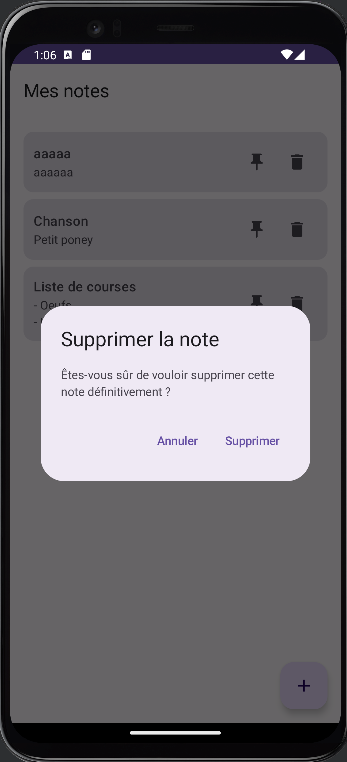
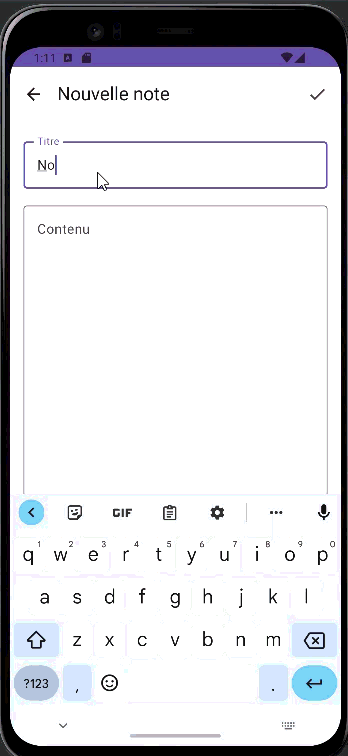

# Projet Notes en Android

## Membres

DAMAS Evan
LARUE Jérémie
ONILLON Julien

## Choix d'implémentation

Pour ce projet, nous avons opté pour une architecture basée sur le pattern MVVM (Model-View-ViewModel) couplé au Repository Pattern. Ce choix permet un découplage efficace entre la couche de données (Room pour la persistance) et la couche de présentation (UI en Jetpack Compose).
Sur le plan technique, nous avons privilégié les outils suivants :
• Jetpack Compose : Utilisation de l'UI déclarative pour une interface réactive et moderne.
• Hilt : Intégration de l'injection de dépendances pour automatiser la gestion des instances (Repository, ViewModel), assurant ainsi une meilleure testabilité et maintenabilité du code.
• Navigation Type-Safe : Mise en œuvre de la nouvelle API de navigation avec kotlinx-serialization pour sécuriser les transitions entre les écrans, garantissant ainsi l'intégrité des arguments passés (notamment pour l'ID des notes).
• Material Design 3 : Application d'un système de design unifié via NotesTheme pour assurer une cohérence visuelle sur tous les écrans.

## Difficultés rencontrées

La difficulté majeure de ce projet n'a pas résidé dans la logique applicative, mais dans la gestion de la configuration et des dépendances Gradle.
Nous avons été confrontés à des conflits de versions binaires complexes, notamment liés aux AAR metadata et à des incompatibilités entre les bibliothèques Jetpack Compose, le plugin Android Gradle (AGP) et le SDK de compilation. L'apparition d'erreurs de type "Backend Internal Error" et "Cannot access class" a nécessité une investigation poussée sur le graphe de dépendances transitives.
Le passage vers la version 2.8.0 de navigation-compose pour implémenter la navigation type-safe a également soulevé des problématiques de compatibilité avec le compileSdk initial. La résolution de ces problèmes a été très formatrice : elle nous a appris à harmoniser manuellement les versions dans le fichier libs.versions.toml, à nettoyer en profondeur le cache de Gradle (via Invalidate Caches et la suppression des dossiers build) et à comprendre l'importance critique de la cohérence entre les versions des plugins et des dépendances pour garantir la stabilité de la compilation.

## Captures d'écrans

